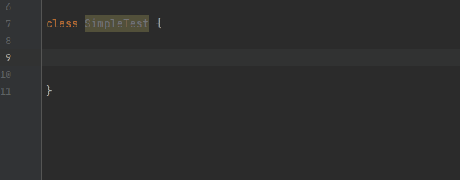
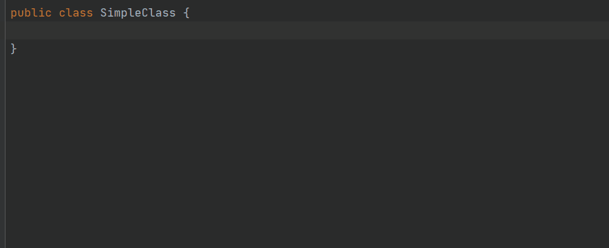
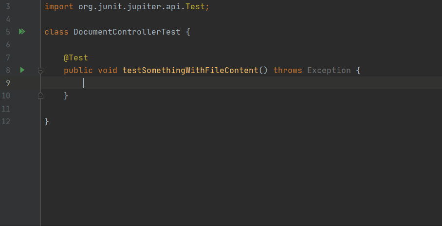
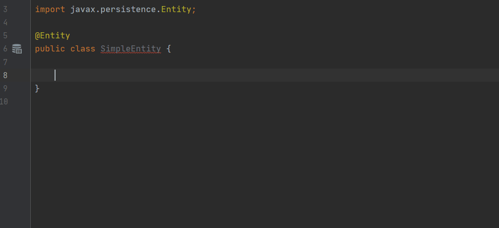

# Custom Live Templates for Java

These are my custom [IntelliJ IDEA Live Templates](https://www.jetbrains.com/help/idea/using-live-templates.html) for Java that i'm currently using.

I thought some of them might be helpful for others so i shared them. If you got other cool custom Java live templates which you want to share, feel free to contribute!

## Export and Import
All these custom live templates are placed in a custom group. According to [sharing live templates](https://www.jetbrains.com/help/idea/sharing-live-templates.html) I've selected only the live templates and created an export. You can import these settings if you want to get all these templates. 
Furthermore I've added the templates config file from the IDEA settings. Copy this file to your IDEA settings directory and you are ready to go.

If you just want to add a single live template you can also create it manually.

## Java
The live templates are all applicable in Java classes.

### JUnit Test Method
Simple test method generation with imported `assertThat` from AssertJ.



Abbreviation: __test__
Template text:
```
@org.junit.jupiter.api.Test
public void test$Function$() {
    org.assertj.core.api.Assertions.assertThat("").isEqualTo("false");
}
```
Options:
- [x] Reformat according to style
- [x] Use static import if possible
- [x] Shorten FQ names

### JUnit Test Method with MockMvc
Test method generation with imported `MockMvc` from Spring.


Abbreviation: __testmvc__
Template text:
```
@org.springframework.beans.factory.annotation.Autowired
private org.springframework.test.web.servlet.MockMvc mockMvc;

@org.junit.jupiter.api.Test
public void test$Function$() throws java.lang.Exception {
    org.springframework.test.web.servlet.request.MockHttpServletRequestBuilder request = org.springframework.test.web.servlet.request.MockMvcRequestBuilders
            .get("")
            .contentType(org.springframework.http.MediaType.APPLICATION_JSON);

    mockMvc.perform(request)
            .andExpect(org.springframework.test.web.servlet.result.MockMvcResultMatchers.status().isOk())
            .andExpect(org.springframework.test.web.servlet.result.MockMvcResultMatchers.content().contentType(org.springframework.http.MediaType.APPLICATION_JSON))
            .andExpect(org.springframework.test.web.servlet.result.MockMvcResultMatchers.jsonPath("", org.hamcrest.Matchers.is("")));
}
```
Options:
- [x] Reformat according to style
- [ ] Use static import if possible
- [x] Shorten FQ names

### Create SLF4J-Logger
Creates SLF4J logger and adds the static imports.



Abbreviation: __log__

Template text:
```java
private static final org.slf4j.Logger LOGGER = org.slf4j.LoggerFactory.getLogger($CLASS$.class);
```
Options:
- [x] Reformat according to style
- [ ] Use static import if possible
- [x] Shorten FQ names

### Load file from resources directory
Load a file from resources directory. Often used in tests to load expected data or other files.



Abbreviation: __resfile__

Template text:
```
java.net.URL resource = getClass().getResource("$Function$");
java.nio.file.Path filePath = java.nio.file.Paths.get(resource.toURI());
```
Options:
- [x] Reformat according to style
- [ ] Use static import if possible
- [x] Shorten FQ names


### Create UUID for Spring Data Entity
Creates ID field for entity class which will be auto generated as UUID.



Abbreviation: __id__

Template text:
```
@javax.persistence.Id
@javax.persistence.GeneratedValue(generator = "system-uuid")
@org.hibernate.annotations.GenericGenerator(name = "system-uuid", strategy = "uuid")
private String id;


```
Options:
- [x] Reformat according to style
- [ ] Use static import if possible
- [x] Shorten FQ names

Applicable: Java - declartion

## Contributing
Want to add some more live templates? Send a pull request or open a ticket!
